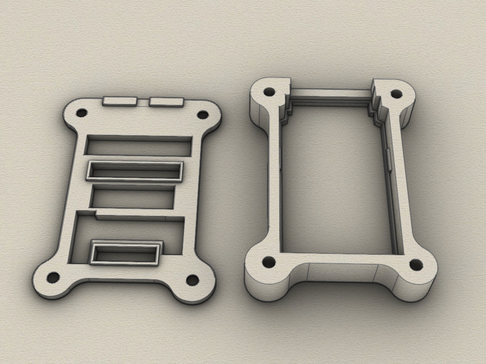
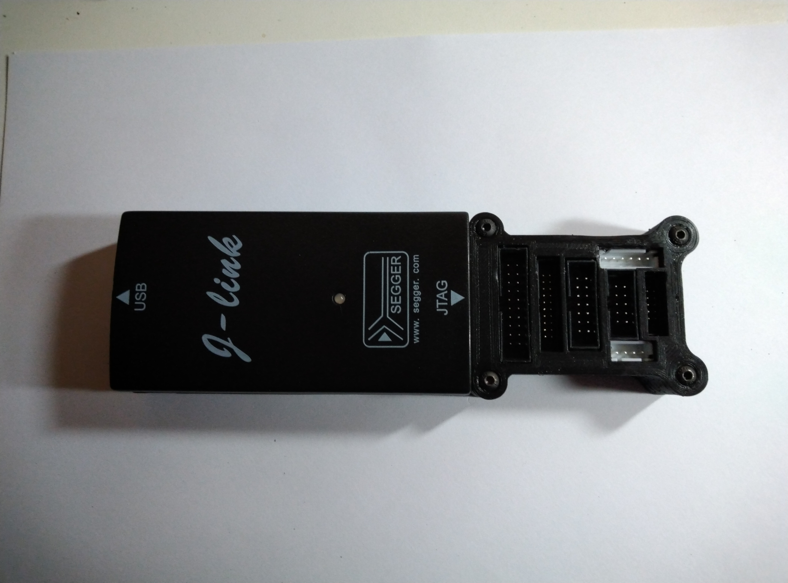
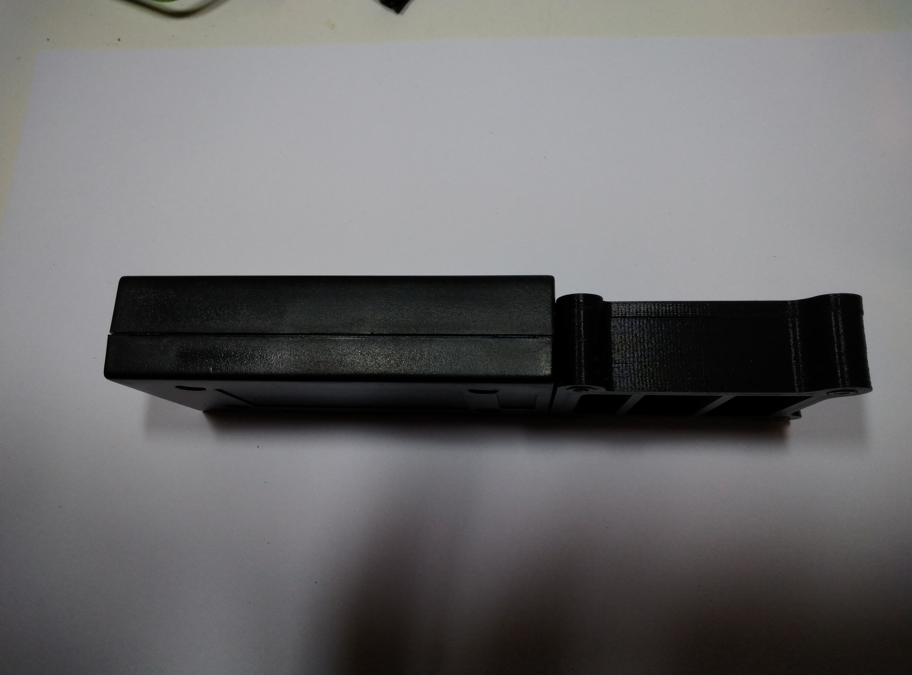
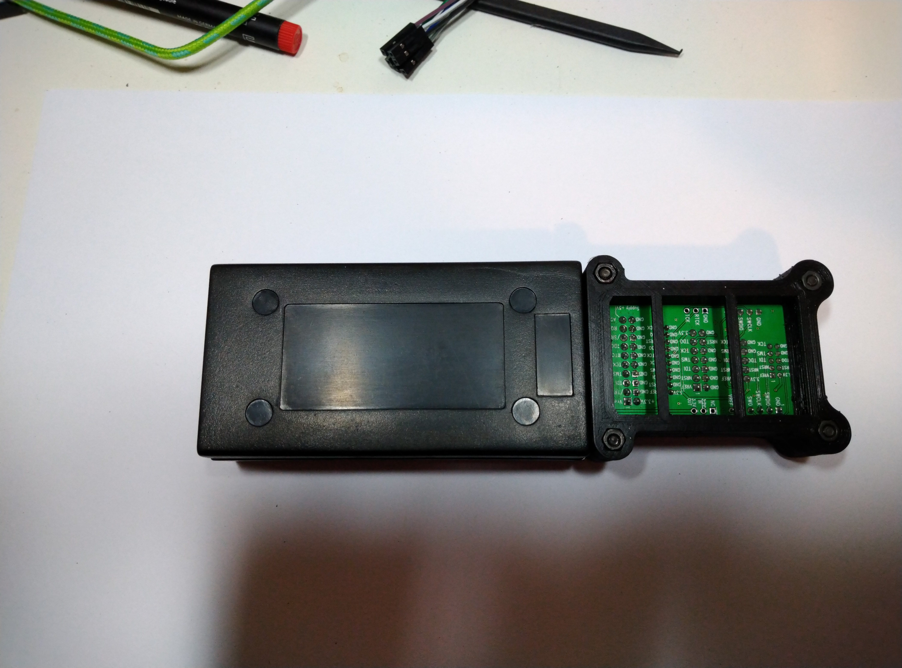

# j-link Adapter-board enclosure
3D printable enclosure for j-link Adapter Board (The Segger j-link). Created with Rhino 6.

## 3D Case

The enclosure consists of 2 parts which are screwed together. 

Requirements:
* 3D printer 
* Filament of your choice
* 4 x 12mm M3 screws

## View

 
 
 
 
 
 
 

